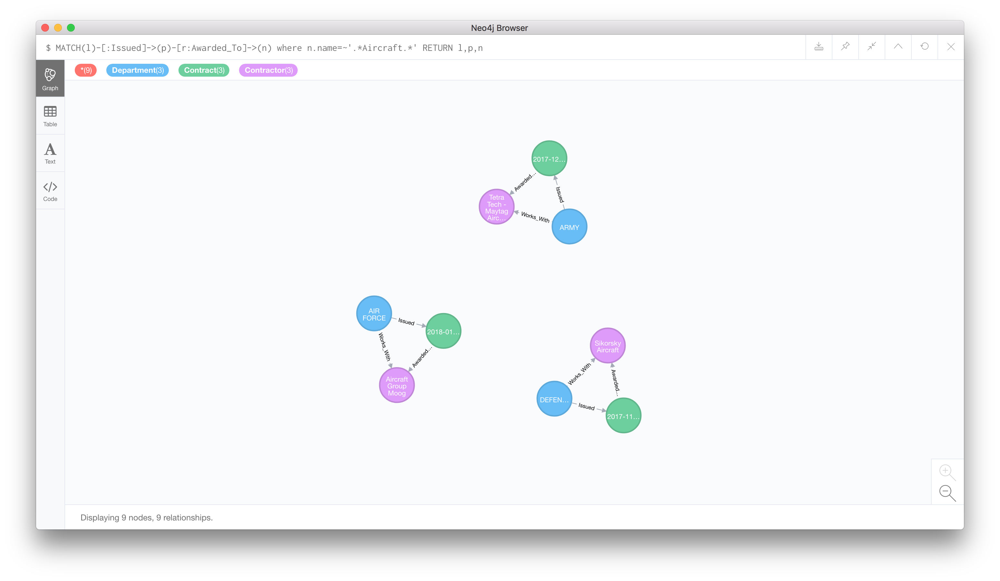
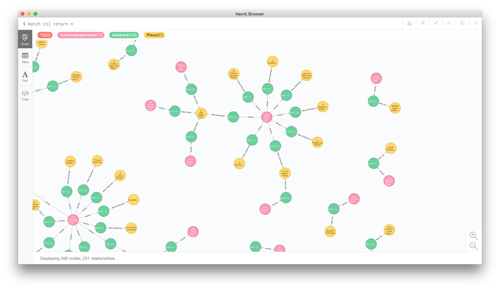

# defense.fishing
> "The most defective method possible would be to approach warfare and the phenomena of armed violence in terms of the ends pursued and not by the nature of the means employed." -- Grégoire Chamayo

## Background
Every day contracts valued $7 million or more are announced by the Department of Defense. These press releases detail the banal logistics of 
supporting the hundreds of thousand DOD buildings and structures located on more than 5,000 different locations across 30 million acres of land globally. Each release catalogues a contract and a corporate entity to whom that contract was awarded.  The release indicates how much money the contract was worth and, generally, what the contract is for - from trousers to radar modules. 

A single release will never reveal conspiracy. Nor will it do too much work to clarify the trajectory of America's Global War on Terror &trade;.  However, our hope is that if taken in aggregate, the relationship between these contract announcements will help us to better understand the phenomena of modern warfare in the United States. 

## Conspiracy Theories and Fever Research

The constellation of press releases paints a picture of an industry thats knotted, tangled, and ultimately unknowable. To engage with this corpus is to chase leads, test conspiracies, and pull on threads until the whole system unravels. This is called fever research - searching uregently for what you know is there but that you can't name.  defense.fish is meant to allow researchers to invent, find, and test conspiracies in press releases.    
## About
- ***what is this***: defense.fish is a tool that generates network maps of coporate entities, contract awards, and military technology based on daily Pentagon press releases.
- ***how does it work***: Contract Announcements are categorized and indexed using keywords and "intelligent tagging". Defense.fish then provides a frontend to query and examine the relationships between tags and contract announcements. 

## Extension Installation
  - git clone https://github.com/dmehrotra/department-of-defense-contracts.git 
  - navigate to chrome://extensions
  - click load unpacked extension and click the department-of-defense-contracts folder

## Neo4j/Cypher Visualizations

This repo contains import scripts so you can import the PSQL DB to a Neo4j db.  The value of this is to visualize connections between contracts, departments, contractors, contracting activities, and the places where the work if performed. 

- 
- 
- 

## Machine Learning and Semantic Analysis 

The DOD-Semantics folder is a semantic analysis of the purposes of each contract.  Ideally it will be used to find similar contracts to eachother. It is an Jupyter Notebook.  To run it pull the repo at run jupyter-notebook. 

## Who do dis?

Dhruv Mehrotra and Leon Eckert
