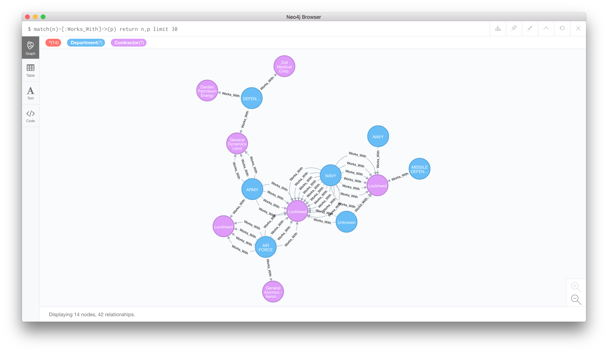

# Department of Defense Contracts

Every day contracts valued at $7 million are announced by the Department of Defense. As far as I can tell there is no well structured database of these contracts. This is a Chrome Extension that will mark up a contract and allow you to submit it to a central database. Not all contracts are written in a standardized way. So before you submit to the database check and make sure the form is filled out correctly.   V Buggy.

## Extension Installation
  - git clone https://github.com/dmehrotra/department-of-defense-contracts.git 
  - navigate to chrome://extensions
  - click load unpacked extension and click the department-of-defense-contracts folder

## Neo4j/Cypher Visualizations

This repo contains import scripts so you can import the PSQL DB to a Neo4j db.  The value of this is to visualize connections between contracts, departments, contractors, contracting activities, and the places where the work if performed. 

- 
- 
- 

## Front End

The front end is a work in progress that will be a Vue/d3 visualization that will allow journalists and researchers to play with our data.  Maybe it will be ready in June.

## Machine Learning and Semantic Analysis 

The DOD-Semantics folder is a semantic analysis of the purposes of each contract.  Ideally it will be used to find similar contracts to eachother. It is an Jupyter Notebook.  To run it pull the repo at run jupyter-notebook. 

## How to use the Extension
   - ask me for a key.  
   - go to: https://www.defense.gov/News/Contracts/
   - choose a day of the week and click the link
   - 
   - submit the form after making sure the fields are correct. 

