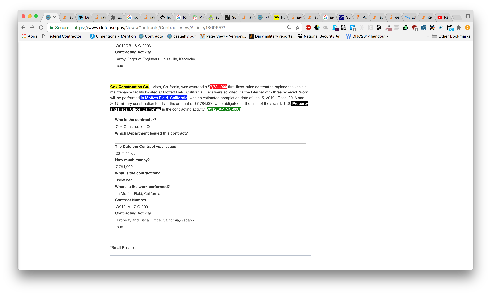

# Extension 

Every day contracts valued at $7 million are announced by the Department of Defense. As far as I can tell there is no well structured database of these contracts. This is a Chrome Extension that will mark up a contract and allow you to submit it to a central database. Not all contracts are written in a standardized way. So before you submit to the database check and make sure the form is filled out correctly.   

## Extension Installation
  - git clone https://github.com/dmehrotra/department-of-defense-contracts.git 
  - navigate to chrome://extensions
  - click load unpacked extension and click the department-of-defense-contracts folder

## How to use the Extension
   - ask me for a key.  
   - go to: https://www.defense.gov/News/Contracts/
   - choose a day of the week and click the link
   - 
   - submit the form after making sure the fields are correct. 